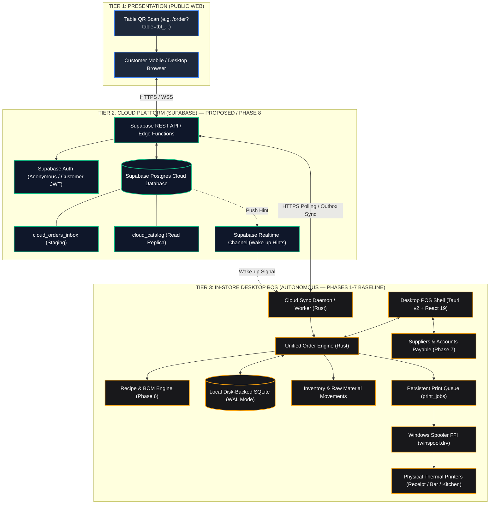
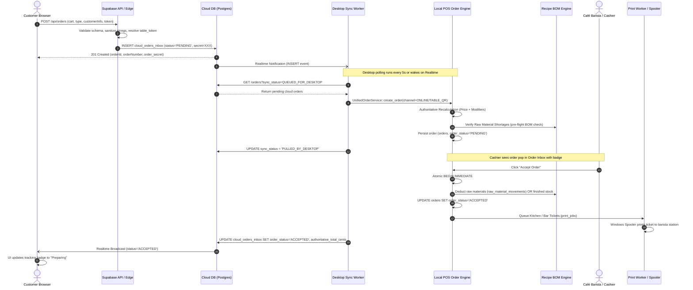
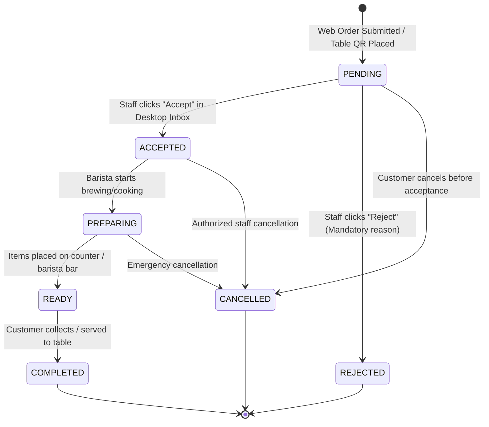
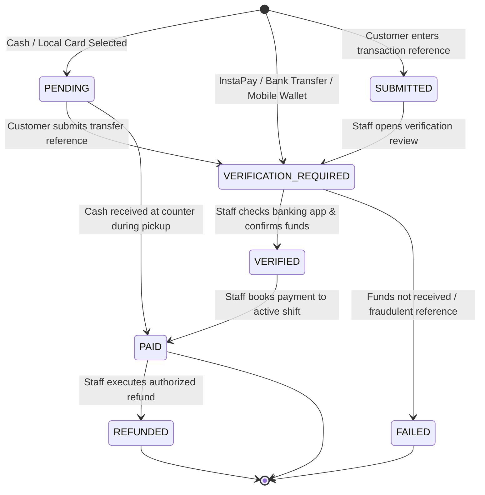
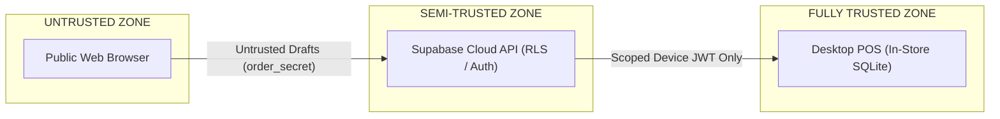

# INBYTE CAFÉ — WEBSITE ENGINEERING HANDOFF & INTEGRATION SPECIFICATION

> **Target Audience:** Senior Web Engineer / Full-Stack Cloud Engineer  
> **Document Status:** CANONICAL PRODUCTION HANDOFF SPECIFICATION  
> **Project Root:** `d:\Work\INBYTE\INBYTE Systems\INBYTE PRODUCTS\INBYTE Cafe`  
> **Applicable Phase:** Phase 8 (Customer Web Commerce & Supabase Cloud Sync Platform)  
> **Baseline Integration Status:** Desktop POS Phases 1–7 Fully Implemented, Accepted & Verified (241 / 241 Tests Passing)

---

## Quick Navigation / Table of Contents
1. [Executive Summary & Core Mandate](#1-executive-summary--core-mandate)
2. [Executive Architecture & System Landscape](#2-executive-architecture--system-landscape)
3. [System Responsibility & Ownership Matrix](#3-system-responsibility--ownership-matrix)
4. [Complete System Classification Matrix (Implemented vs Planned vs Deferred)](#4-complete-system-classification-matrix)
5. [Entity Mapping: Desktop SQLite ↔ Cloud Supabase](#5-entity-mapping-desktop-sqlite--cloud-supabase)
6. [Website Responsibilities & Prohibitions](#6-website-responsibilities--prohibitions)
7. [Cloud Backend & Supabase Responsibilities](#7-cloud-backend--supabase-responsibilities)
8. [Database Architecture (Desktop Implementation vs Proposed Cloud)](#8-database-architecture)
9. [Online Order Lifecycle & State Machines](#9-online-order-lifecycle--state-machines)
10. [Price Authority & Anti-Tampering Architecture](#10-price-authority--anti-tampering-architecture)
11. [Inventory, Recipe BOM & Costing Architecture (Phase 6 & 7 Realities)](#11-inventory-recipe-bom--costing-architecture)
12. [Purchasing, Suppliers & Accounts Payable Boundary (Phase 7 Realities)](#12-purchasing-suppliers--accounts-payable-boundary)
13. [Payment Architecture & Integration Boundary](#13-payment-architecture--integration-boundary)
14. [Security Architecture & Zero-Trust Boundary](#14-security-architecture--zero-trust-boundary)
15. [Proposed Cloud API Contract (Phase 8 Specification)](#15-proposed-cloud-api-contract-phase-8-specification)
16. [Hybrid Realtime & Polling Synchronization Model](#16-hybrid-realtime--polling-synchronization-model)
17. [Multi-Store & Multi-Branch Tenant Scoping](#17-multi-store--multi-branch-tenant-scoping)
18. [Recommended Website Codebase Structure](#18-recommended-website-codebase-structure)
19. [Website UI Page Architecture & Screen Flows](#19-website-ui-page-architecture--screen-flows)
20. [Explicit Out-of-Scope Boundaries](#20-explicit-out-of-scope-boundaries)
21. [Comprehensive Error Handling & Error Codes](#21-comprehensive-error-handling--error-codes)
22. [Ten Concrete Offline & Failure Scenarios](#22-ten-concrete-offline--failure-scenarios)
23. [Thermal Printing Subsystem Boundary](#23-thermal-printing-subsystem-boundary)
24. [What the Web Engineer MUST Implement (Phase 8 Roadmap)](#24-what-the-web-engineer-must-implement-phase-8-roadmap)
25. [What the Web Engineer MUST NOT Do (Strict Prohibitions)](#25-what-the-web-engineer-must-not-do-strict-prohibitions)
26. [Testing Contract & Verification Gates](#26-testing-contract--verification-gates)
27. [Environment Variables & Secret Management](#27-environment-variables--secret-management)
28. [START HERE: Practical Guide for the Web Engineer](#28-start-here-practical-guide-for-the-web-engineer)
29. [Historical Discrepancies Resolved & Architectural Facts](#29-historical-discrepancies-resolved--architectural-facts)
30. [Non-Negotiable Architectural Rules](#30-non-negotiable-architectural-rules)

---

## 1. Executive Summary & Core Mandate

This engineering handoff document is the canonical architectural and technical specification for building the **INBYTE Café customer-facing website, digital ordering application, and cloud integration layer**.

INBYTE Café is a **local-first, autonomous café operations system**. The in-store desktop Point-of-Sale (POS) application runs on Windows (Tauri v2 + Rust + React 19) backed by a local disk-backed SQLite database operating in WAL (Write-Ahead Logging) mode. In-store counter sales, cashier shifts, inventory tracking, raw material recipe consumption, back-office purchasing, supplier payables, and physical thermal ticket printing operate with **100% offline autonomy**.

The desktop product through Phase 7 is fully implemented, verified, and locked as the authoritative baseline (241/241 automated integration tests passing):
- **Phase 1:** Core Foundation & SQLite Engine (12/12 passed)
- **Phase 2:** POS Core / Catalog / Sales Engine (25/25 passed)
- **Phase 3:** Inventory / Stocktaking / Returns / Audit Engine (38/38 passed)
- **Phase 4:** Tables + QR Ordering + Unified Order Engine + Inbox (40/40 passed)
- **Phase 5:** Thermal & Barista Printing Engine via Win32 Spooler (46/46 passed)
- **Phase 6:** Raw Materials, Recipes (BOM) & Costing Foundation (40/40 passed)
- **Phase 7:** Back Office Purchasing, Suppliers & Accounts Payable (40/40 passed)

The purpose of the customer website (Phase 8) is to extend the café's reach to:
1. **Dine-In Self-Ordering:** Seated customers scan an opaque, unguessable table QR code (`tbl_...`) to browse the live menu, configure drinks, and submit orders directly to the barista's counter Order Inbox without waiting for staff.
2. **Takeaway Pickup Pre-Ordering:** Remote customers pre-order coffee and food for collection at the counter.
3. **Neighborhood Delivery Ordering:** Remote customers submit delivery orders with contact details and physical delivery addresses.

### Core Architectural Mandate
> **The customer website NEVER connects directly to the local desktop SQLite database, NEVER calculates authoritative financial totals, NEVER marks orders as PAID or ACCEPTED, NEVER directly mutates store inventory or raw materials, and NEVER has access to back-office purchasing or supplier data.**
> 
> The local desktop POS remains the sole authoritative arbiter of catalog prices, inventory balances, drawer accounting, order acceptance, and physical ticket printing. The cloud layer (Supabase) serves strictly as a secure, tenant-isolated buffer, synchronization staging engine, and customer-facing read-replica API.

---

## 2. Executive Architecture & System Landscape

The system comprises three physical tiers: the Customer Web Client, the Cloud Backend (Supabase), and the In-Store Desktop POS Station.



---

## 3. System Responsibility & Ownership Matrix

Every piece of data and operational decision has an unambiguous, single authority across the ecosystem:

| Domain / Entity | Customer Website | Cloud Backend (Supabase) | Desktop POS (Rust Core) | Local SQLite Database | Authoritative Source |
| :--- | :--- | :--- | :--- | :--- | :--- |
| **Product Catalog** | Read-Only (Display) | Read Replica (Synced from Desktop) | Authoritative Editor (Owner Only) | Authoritative Master Copy | **Desktop Local SQLite** |
| **Item Pricing & Modifiers** | Read-Only (Display) | Read Replica / Validator | Authoritative Recalculation Engine | Authoritative Master Copy | **Desktop POS Engine** |
| **Finished Goods Stock** | Read-Only (Availability Hints) | Read-Only Cached Availability | Authoritative Ledger Deductor | Authoritative Master (`stock >= 0`) | **Desktop POS Engine** |
| **Raw Materials & BOM Recipes** | Zero Knowledge | Zero Knowledge | Authoritative Recipe Engine | Authoritative Master (`raw_materials`) | **Desktop POS Engine (Phase 6)** |
| **Table Metadata & Tokens** | Read-Only Token Context | Read-Only Token Resolver | Authoritative Table Manager | Authoritative Master (`tables`) | **Desktop Local SQLite** |
| **Order Placement (Cart)** | Submits Untrusted Draft | Validates Schema & Stages | Decides `ACCEPTED` or `REJECTED` | Authoritative Master (`orders`) | **Desktop POS Engine** |
| **Order Acceptance** | Display Only | Relays State Transition | Staff Accept Button (`ACCEPTED`) | Authoritative Master | **Desktop Cashier** |
| **Payment Verification** | Submits Reference / Proof | Staging / Gateway Callback | Staff Verify Button (`VERIFIED` $\rightarrow$ `PAID`) | Authoritative Master (`payments`) | **Desktop Active Shift** |
| **Cash Drawer Accounting** | Zero Knowledge | Zero Knowledge | Authoritative Drawer Balance | Authoritative Master (`shifts`) | **Desktop POS Engine** |
| **Thermal Ticket Printing** | Zero Knowledge | Zero Knowledge | Authoritative Worker (`winspool.drv`) | Authoritative Master (`print_jobs`) | **Desktop Print Worker** |
| **Customer Identification** | Submits Name, Phone, Address | Scopes Session / JWT | Operational Viewing for Dispatch | Stored on Order Record | **Customer (Verified by Staff)** |
| **Suppliers & Purchasing** | **Zero Knowledge** | **Zero Knowledge** | Authoritative AP & Receiving Engine | Authoritative Master (`suppliers`, `supplier_ledger`) | **Desktop Back Office (Phase 7)** |
| **Accounts Payable Disbursements** | **Zero Knowledge** | **Zero Knowledge** | Strict Tender Matrix Enforcement | Authoritative Master (`supplier_payments`) | **Desktop Back Office (Phase 7)** |

---

## 4. Complete System Classification Matrix

To eliminate any ambiguity between what exists now, what is planned for web, what is deferred, and what is strictly out of scope, all system capabilities are rigorously classified below:

| Capability / Subsystem | Classification | Implementation Phase | Authority & Location |
| :--- | :---: | :---: | :--- |
| **Desktop Shell & IPC Infrastructure** | **(A) Implemented Now** | Phase 1 | `ui/src-tauri/`, Rust Tauri v2 commands |
| **SQLite WAL Persistence & Busy Timeout** | **(A) Implemented Now** | Phase 1 | `src/infrastructure/persistence/` |
| **Product Catalog & Modifiers CRUD** | **(A) Implemented Now** | Phase 2 | `ProductService`, `ModifierService` |
| **Sales Engine & Cashier Shifts** | **(A) Implemented Now** | Phase 2 | `ShiftService`, `CheckoutService` |
| **Inventory Ledger & Stocktaking** | **(A) Implemented Now** | Phase 3 | `InventoryService`, `inventory_movements` |
| **Table CRUD & Cryptographic QR Tokens** | **(A) Implemented Now** | Phase 4 | `TableService`, `tables` |
| **Unified Order Engine (Counter/Dine-In/Online)** | **(A) Implemented Now** | Phase 4 | `UnifiedOrderService`, `orders` |
| **Order Inbox with Live Status Badges** | **(A) Implemented Now** | Phase 4 | `App.tsx`, `get_order_inbox` |
| **Thermal Printing via Win32 Spooler** | **(A) Implemented Now** | Phase 5 | `src/infrastructure/printing/` |
| **Pure Rust Arabic Text Shaper & BiDi** | **(A) Implemented Now** | Phase 5 | `printing/arabic.rs` |
| **Raw Materials & Recipe BOM Costing** | **(A) Implemented Now** | Phase 6 | `RecipeService`, `raw_materials` |
| **BOM Multi-Item Consumption on Order** | **(A) Implemented Now** | Phase 6 | `UnifiedOrderService` (recipe-driven) |
| **Suppliers Directory & Active Management** | **(A) Implemented Now** | Phase 7 | `SupplierService`, `suppliers` |
| **Authoritative Supplier Payables Subledger** | **(A) Implemented Now** | Phase 7 | `AccountsPayableService`, `supplier_ledger` |
| **Purchase Invoicing & Atomic Receiving** | **(A) Implemented Now** | Phase 7 | `PurchaseService`, `purchase_invoices` |
| **Moving Weighted Average Cost (WAC)** | **(A) Implemented Now** | Phase 7 | $i128$ math with `div_half_up` rounding |
| **Dual Storage Idempotency for Receiving** | **(A) Implemented Now** | Phase 7 | Partial unique indexes in SQLite |
| **Strict AP Payment Tender Matrix** | **(A) Implemented Now** | Phase 7 | Cashier Drawer vs Safe vs Bank/Check |
| **Desktop Outbox & Staging Schemas** | **(B) Defined in Schema** | Phases 1 & 4 | `online_orders_inbox`, `cloud_sync_outbox` |
| **Desktop $\leftrightarrow$ Cloud Sync Daemon** | **(C) Planned for Web** | Phase 8 | To be built in Rust desktop engine |
| **Supabase Cloud Database & RLS** | **(C) Planned for Web** | Phase 8 | To be provisioned by Web Engineer |
| **Customer Web Application (Public Ordering)** | **(C) Planned for Web** | Phase 8 | Next.js / Vite React public web app |
| **Table QR Customer Web Flow** | **(C) Planned for Web** | Phase 8 | `/order?table=tbl_...` customer UX |
| **Online Takeaway Pickup & Delivery Checkout**| **(C) Planned for Web** | Phase 8 | Customer details capture & validation |
| **Realtime Customer Order Tracking** | **(C) Planned for Web** | Phase 8 | Stepper progress via Supabase Realtime |
| **Direct Gateway Online Payments (Paymob/Fawry)**| **(D) Future / Deferred**| Phase 8+ | Enum `ONLINE_PAID` ready; provider deferred |
| **Customer Web Loyalty Accounts & CRM** | **(D) Future / Deferred** | Future | Customer profile & loyalty balance |
| **Automated Supplier Credit Allocation** | **(D) Future / Deferred** | Future | Explicit invoice-credit allocation UX |
| **Public Admin / Management Website** | **(E) STRICTLY OUT OF SCOPE**| Never | Administration is strictly local desktop |
| **Web Direct SQLite Connection** | **(E) STRICTLY OUT OF SCOPE**| Never | Desktop SQLite is completely air-gapped |
| **Web Table Reservation / Booking Engine** | **(E) STRICTLY OUT OF SCOPE**| Never | Café operates on walk-in seating only |
| **Web Direct Thermal Printer Access** | **(E) STRICTLY OUT OF SCOPE**| Never | Printing is in-store Win32 Spooler only |
| **Web-Triggered Stock Deductions** | **(E) STRICTLY OUT OF SCOPE**| Never | Inventory deductions are desktop-only |

---

## 5. Entity Mapping: Desktop SQLite ↔ Cloud Supabase

The web engineer must map public-facing data between the local desktop SQLite database and the proposed Supabase PostgreSQL cloud database:

| Desktop SQLite Entity (Phases 1–7 Baseline) | Proposed Cloud Supabase Entity | Sync Direction | Master Authority | Web Engineer Action |
| :--- | :--- | :---: | :--- | :--- |
| `categories` | `cloud_categories` | Desktop $\rightarrow$ Cloud | Desktop Local SQLite | Render category tabs; sort by `sort_order`. |
| `products` | `cloud_products` | Desktop $\rightarrow$ Cloud | Desktop Local SQLite | Render menu cards; hide if `is_available_online = 0`. |
| `modifier_groups` | `cloud_modifier_groups` | Desktop $\rightarrow$ Cloud | Desktop Local SQLite | Render modifier sections; enforce `is_required`. |
| `modifier_options` | `cloud_modifier_options` | Desktop $\rightarrow$ Cloud | Desktop Local SQLite | Render options with live price delta badges. |
| `product_modifier_links` | `cloud_product_modifiers` | Desktop $\rightarrow$ Cloud | Desktop Local SQLite | Associate modifier groups with specific products. |
| `tables` | `cloud_tables` | Desktop $\rightarrow$ Cloud | Desktop Local SQLite | Resolve `qr_token` to validate table presence. |
| `orders` | `cloud_orders_inbox` | Bidirectional | Desktop Engine | Web writes `PENDING` draft; Desktop writes status updates. |
| `order_items` | `cloud_orders_inbox.items_json`| Web $\rightarrow$ Cloud $\rightarrow$ Desktop | Desktop Engine | Web serializes JSON; Desktop re-verifies prices. |
| `inventory_movements` | *None* | Local Only | Desktop Engine | **NO CLOUD ACCESS.** Stock deducted locally on acceptance. |
| `raw_materials` | *None* | Local Only | Desktop Engine | **NO CLOUD ACCESS.** Raw materials are Back Office only. |
| `product_recipes` | *None* | Local Only | Desktop Engine | **NO CLOUD ACCESS.** Recipes are Back Office only. |
| `suppliers` | *None* | Local Only | Desktop Engine | **NO CLOUD ACCESS.** Suppliers are Back Office only. |
| `purchase_invoices` | *None* | Local Only | Desktop Engine | **NO CLOUD ACCESS.** Purchasing is Back Office only. |
| `supplier_ledger` | *None* | Local Only | Desktop Engine | **NO CLOUD ACCESS.** AP Subledger is Back Office only. |
| `supplier_payments` | *None* | Local Only | Desktop Engine | **NO CLOUD ACCESS.** Disbursements are Back Office only. |
| `shifts` | *None* | Local Only | Desktop Engine | **NO CLOUD ACCESS.** Cashier shifts are Back Office only. |
| `cash_drawer_movements` | *None* | Local Only | Desktop Engine | **NO CLOUD ACCESS.** Drawer accounting is Back Office only. |
| `print_jobs` | *None* | Local Only | Desktop Engine | **NO CLOUD ACCESS.** Printing is Win32 Spooler only. |

---

## 6. Website Responsibilities & Prohibitions

### 6.1 What the Website MUST Own
1. **Responsive, Mobile-First Ordering UX:**
   - 90%+ of digital orders originate from smartphones. Viewports (360px–430px) must have high-speed, thumb-friendly touch targets.
   - Fluid desktop layout for takeaway pickup and delivery orders.
2. **Bilingual Presentation (RTL Arabic & LTR English):**
   - Full Right-to-Left (RTL) Arabic typography using standard Cairo or IBM Plex Sans Arabic web fonts.
   - Seamless language toggle preserving active cart state.
3. **Menu Browsing & Visual Hierarchy:**
   - Categorized menu display sorted by `categories.sort_order`.
   - Clear display of product names, descriptions, images, and base prices.
   - Out-of-stock indicators based on synced product availability (`is_available_online = 1` and `in_stock = true`).
4. **Interactive Modifier Selection:**
   - Radio buttons for single-choice required groups (e.g. Milk: Whole, Oat, Almond).
   - Checkboxes with option caps for multi-choice optional groups (e.g. Syrups: Vanilla, Caramel).
   - Dynamic client-side price preview: displays live calculated price delta ($+\Delta$) as options are selected.
5. **Contextual Order Flow Segmentation:**
   - **`DINE_IN` Flow:** Activated exclusively when a valid `?table=tbl_...` QR token is present. Pre-binds table number. Prompts **only** for optional customer notes. Collects zero delivery or phone data.
   - **`PICKUP` Flow:** Collects customer name and mobile phone number.
   - **`DELIVERY` Flow:** Collects customer name, mobile phone number, and physical delivery address/notes.
6. **Local Cart Management:**
   - Persists active cart in browser `localStorage` or `sessionStorage` to prevent loss on page refresh.
   - Enforces modifier rules (cannot add item to cart if required modifier group is unselected).
7. **Order Submission & Order Secret Storage:**
   - Submits structured JSON cart payloads to the Cloud API.
   - Receives and securely stores an opaque `order_secret` in `sessionStorage` for order tracking.
8. **Live Order Tracking & Polling:**
   - Displays real-time progress through states: `PENDING` $\rightarrow$ `ACCEPTED` $\rightarrow$ `PREPARING` $\rightarrow$ `READY` $\rightarrow$ `COMPLETED` (or `REJECTED` / `CANCELLED`).
   - Listens to Supabase Realtime order status changes with fallback REST polling every 5 seconds.

### 6.2 What the Website MUST NOT Own (Strict Prohibitions)
- ❌ **NEVER calculate authoritative financial totals:** The browser calculates an estimated total for display, but the desktop engine completely re-computes line totals, modifier deltas, and discounts from database records upon receipt.
- ❌ **NEVER mark an order as `PAID`:** The client can only submit payment intent or payment references (`payment_status = 'PENDING'` or `'VERIFICATION_REQUIRED'`).
- ❌ **NEVER mark an order as `ACCEPTED`:** The order enters `PENDING` and remains there until physical café staff click "Accept" in the desktop Order Inbox.
- ❌ **NEVER mutate inventory stock or raw materials:** The website has zero write access to stock ledgers.
- ❌ **NEVER touch cashier or shift identities:** The website cannot supply `cashier_id` or `shift_id`.
- ❌ **NEVER communicate directly with thermal printers or Windows Spoolers:** Printing is an in-store hardware side effect triggered solely by local desktop state transitions.
- ❌ **NEVER access local SQLite files:** The website has zero network route to the desktop computer's disk.
- ❌ **NEVER access Back Office suppliers or purchase invoices:** Supplier directories, purchasing, and Accounts Payable are strictly desktop-only and must never be exposed to the public web.

---

## 7. Cloud Backend & Supabase Responsibilities

The Cloud Backend acts as a secure buffer between the untrusted public internet and the local POS station.

### 7.1 Cloud Responsibilities
1. **Multi-Store Scoping & Isolation:**
   - Every cloud record is partitioned by `store_id` (UUID).
   - Row-Level Security (RLS) policies prevent cross-tenant leakage.
2. **Client Rate Limiting & Abuse Prevention:**
   - Throttles public order submissions (e.g. maximum 5 orders per IP per 10 minutes) to prevent denial-of-service or fake order flooding.
3. **Payload Sanitization & Structural Validation:**
   - Validates that product IDs and modifier option IDs exist in the active catalog replica.
   - Sanitizes text inputs (customer names, addresses, notes) against XSS and control character injection (`< 0x20`).
4. **Order Staging (`cloud_orders_inbox`):**
   - Persists incoming web orders with an initial status of `'PENDING'`.
   - Generates a cryptographically random `order_secret` (32-character hex) returned exclusively to the submitting browser for tracking authorization.
5. **Desktop POS Authentication:**
   - Issues long-lived, scoped Device JWTs to authorized in-store desktop POS terminals.
   - Restricts synchronization endpoints so that only authenticated desktop terminals can poll or acknowledge inbox orders.
6. **Realtime Event Broadcasts:**
   - Publishes lightweight wake-up signals over Supabase Realtime when a new order is inserted into `cloud_orders_inbox`.
   - Publishes order status progression events to the customer tracking channel (`orders:order_id`).

---

## 8. Database Architecture

### 8.1 Local Desktop SQLite Schema (Actual Implementation — Phases 1 to 7)
The local SQLite database (`inbyte_cafe.db`) is the authoritative source of truth. The following tables govern the system:

```sql
-- 1. Product Categories (Migration V001)
CREATE TABLE categories (
    id INTEGER PRIMARY KEY AUTOINCREMENT,
    name TEXT NOT NULL UNIQUE,
    sort_order INTEGER NOT NULL DEFAULT 0,
    is_active INTEGER NOT NULL DEFAULT 1,
    is_available_online INTEGER NOT NULL DEFAULT 1
);

-- 2. Products (Migrations V001 & V002)
CREATE TABLE products (
    id INTEGER PRIMARY KEY AUTOINCREMENT,
    category_id INTEGER NOT NULL REFERENCES categories(id),
    name TEXT NOT NULL,
    barcode TEXT UNIQUE,
    cost_price_cents INTEGER NOT NULL DEFAULT 0 CHECK (cost_price_cents >= 0),
    selling_price_cents INTEGER NOT NULL CHECK (selling_price_cents > 0),
    stock INTEGER NOT NULL DEFAULT 0 CHECK (stock >= 0),
    track_inventory INTEGER NOT NULL DEFAULT 1,
    is_active INTEGER NOT NULL DEFAULT 1,
    is_available_online INTEGER NOT NULL DEFAULT 0,
    online_description TEXT,
    online_image_url TEXT,
    search_token TEXT NOT NULL,
    low_stock_threshold INTEGER NOT NULL DEFAULT 5 CHECK (low_stock_threshold >= 0)
);

-- 3. Modifiers (Migration V001)
CREATE TABLE modifier_groups (
    id INTEGER PRIMARY KEY AUTOINCREMENT,
    name TEXT NOT NULL,
    is_required INTEGER NOT NULL DEFAULT 0,
    allow_multiple INTEGER NOT NULL DEFAULT 0
);

CREATE TABLE modifier_options (
    id INTEGER PRIMARY KEY AUTOINCREMENT,
    group_id INTEGER NOT NULL REFERENCES modifier_groups(id) ON DELETE CASCADE,
    name TEXT NOT NULL,
    price_delta_cents INTEGER NOT NULL DEFAULT 0
);

CREATE TABLE product_modifier_links (
    product_id INTEGER NOT NULL REFERENCES products(id) ON DELETE CASCADE,
    group_id INTEGER NOT NULL REFERENCES modifier_groups(id) ON DELETE CASCADE,
    PRIMARY KEY (product_id, group_id)
);

-- 4. Tables (Migration V003)
CREATE TABLE tables (
    id INTEGER PRIMARY KEY AUTOINCREMENT,
    table_number TEXT NOT NULL UNIQUE,
    display_label TEXT,
    is_active INTEGER NOT NULL DEFAULT 1,
    qr_token TEXT NOT NULL UNIQUE,
    status TEXT NOT NULL DEFAULT 'AVAILABLE' CHECK (status IN ('AVAILABLE', 'ORDERING', 'ACTIVE', 'PREPARING', 'READY')),
    created_at TEXT NOT NULL DEFAULT (datetime('now')),
    updated_at TEXT NOT NULL DEFAULT (datetime('now'))
);

-- 5. Canonical Orders (Migration V003)
CREATE TABLE orders (
    id INTEGER PRIMARY KEY AUTOINCREMENT,
    order_number TEXT NOT NULL UNIQUE,
    shift_id INTEGER REFERENCES shifts(id),           -- NULL for remote customer orders
    cashier_id INTEGER REFERENCES users(id),          -- NULL for remote customer orders
    table_id INTEGER REFERENCES tables(id),           -- Required for DINE_IN, NULL otherwise
    order_type TEXT NOT NULL DEFAULT 'COUNTER' CHECK (order_type IN ('COUNTER', 'DINE_IN', 'PICKUP', 'DELIVERY')),
    order_channel TEXT NOT NULL DEFAULT 'COUNTER' CHECK (order_channel IN ('COUNTER', 'TABLE_QR', 'ONLINE')),
    order_status TEXT NOT NULL DEFAULT 'COMPLETED' CHECK (order_status IN (
        'PENDING', 'ACCEPTED', 'PREPARING', 'READY', 'COMPLETED', 'CANCELLED', 'REJECTED'
    )),
    subtotal_cents INTEGER NOT NULL CHECK (subtotal_cents >= 0),
    discount_cents INTEGER NOT NULL DEFAULT 0 CHECK (discount_cents >= 0),
    total_cents INTEGER NOT NULL CHECK (total_cents >= 0),
    payment_method TEXT NOT NULL DEFAULT 'CASH' CHECK (payment_method IN (
        'CASH', 'CREDIT_CARD', 'BANK_TRANSFER', 'INSTAPAY', 'WALLET', 'ONLINE_PAID'
    )),
    payment_status TEXT NOT NULL DEFAULT 'PAID' CHECK (payment_status IN (
        'PENDING', 'SUBMITTED', 'VERIFICATION_REQUIRED', 'VERIFIED', 'PAID', 'FAILED', 'REFUNDED'
    )),
    customer_name TEXT,
    customer_phone TEXT,
    delivery_address TEXT,
    customer_notes TEXT,
    rejection_reason TEXT,
    source TEXT NOT NULL DEFAULT 'POS_COUNTER' CHECK (source IN ('POS_COUNTER', 'ONLINE_ORDER')),
    external_online_id TEXT UNIQUE,
    status TEXT NOT NULL DEFAULT 'PAID' CHECK (status IN ('PAID', 'REFUNDED', 'PARTIALLY_REFUNDED', 'PENDING')),
    created_at TEXT NOT NULL DEFAULT (datetime('now')),
    updated_at TEXT NOT NULL DEFAULT (datetime('now'))
);

-- 6. Canonical Order Items (Migration V001)
CREATE TABLE order_items (
    id INTEGER PRIMARY KEY AUTOINCREMENT,
    order_id INTEGER NOT NULL REFERENCES orders(id) ON DELETE CASCADE,
    product_id INTEGER NOT NULL REFERENCES products(id),
    unit_price_cents INTEGER NOT NULL CHECK (unit_price_cents >= 0),
    quantity INTEGER NOT NULL CHECK (quantity > 0),
    modifiers_summary TEXT,
    modifiers_total_cents INTEGER NOT NULL DEFAULT 0,
    line_total_cents INTEGER NOT NULL CHECK (line_total_cents >= 0)
);

-- 7. Finished Goods Inventory Movements (Migration V002)
CREATE TABLE inventory_movements (
    id INTEGER PRIMARY KEY AUTOINCREMENT,
    product_id INTEGER NOT NULL REFERENCES products(id),
    movement_type TEXT NOT NULL CHECK (movement_type IN (
        'SALE', 'RETURN', 'PURCHASE', 'ADJUSTMENT', 'STOCKTAKE_ADJUSTMENT', 'WASTE_SPOILED', 'INTERNAL_USE'
    )),
    quantity_delta INTEGER NOT NULL CHECK (quantity_delta != 0),
    balance_after INTEGER NOT NULL,
    unit_cost_cents INTEGER NOT NULL,
    reference_type TEXT NOT NULL,                      -- 'ORDER' for sales
    reference_id TEXT NOT NULL,                        -- order_id
    notes TEXT,
    user_id INTEGER NOT NULL REFERENCES users(id),
    created_at TEXT NOT NULL DEFAULT (datetime('now'))
);

-- Exactly-once deduction enforcement per online order item
CREATE UNIQUE INDEX idx_inv_online_deduct 
ON inventory_movements(reference_type, reference_id, product_id)
WHERE reference_type = 'ONLINE_ORDER';

-- 8. Raw Materials & Recipes BOM (Migration V005 — Phase 6 Baseline)
-- NOTE: Back Office only; NOT accessible from public web!
CREATE TABLE raw_materials (
    id INTEGER PRIMARY KEY AUTOINCREMENT,
    name TEXT NOT NULL UNIQUE,
    sku TEXT UNIQUE,
    category TEXT NOT NULL CHECK (category IN ('COFFEE_BEANS', 'DAIRY', 'SYRUPS', 'CONSUMABLES', 'PACKAGING')),
    base_unit TEXT NOT NULL CHECK (base_unit IN ('G', 'ML', 'PCS')),
    current_stock_milli INTEGER NOT NULL DEFAULT 0 CHECK (current_stock_milli >= 0),
    minimum_threshold_milli INTEGER NOT NULL DEFAULT 0 CHECK (minimum_threshold_milli >= 0),
    cost_per_base_unit_milli_cents INTEGER NOT NULL DEFAULT 0 CHECK (cost_per_base_unit_milli_cents >= 0),
    is_active INTEGER NOT NULL DEFAULT 1,
    search_token TEXT NOT NULL,
    created_at TEXT NOT NULL DEFAULT (datetime('now')),
    updated_at TEXT NOT NULL DEFAULT (datetime('now'))
);

CREATE TABLE raw_material_movements (
    id INTEGER PRIMARY KEY AUTOINCREMENT,
    raw_material_id INTEGER NOT NULL REFERENCES raw_materials(id) ON DELETE RESTRICT,
    movement_type TEXT NOT NULL CHECK (movement_type IN (
        'PURCHASE', 'PRODUCTION_CONSUMPTION', 'RETURN_RESTOCK', 'ADJUSTMENT', 'WASTE_SPOILED', 'INTERNAL_USE'
    )),
    quantity_delta_milli INTEGER NOT NULL CHECK (quantity_delta_milli != 0),
    balance_after_milli INTEGER NOT NULL,
    unit_cost_milli_cents INTEGER NOT NULL CHECK (unit_cost_milli_cents >= 0),
    total_cost_cents INTEGER NOT NULL,
    reference_type TEXT NOT NULL,                      -- 'ORDER' for sales, 'PURCHASE_INVOICE' for purchases
    reference_id TEXT NOT NULL,
    notes TEXT,
    user_id INTEGER NOT NULL REFERENCES users(id),
    created_at TEXT NOT NULL DEFAULT (datetime('now'))
);

-- 9. Back Office Purchasing & Accounts Payable (Migration V006 — Phase 7 Baseline)
-- NOTE: Back Office only; ZERO public web touchpoints!
CREATE TABLE suppliers (
    id INTEGER PRIMARY KEY AUTOINCREMENT,
    name TEXT NOT NULL UNIQUE COLLATE NOCASE,
    contact_person TEXT,
    phone TEXT,
    email TEXT,
    tax_number TEXT,
    address TEXT,
    notes TEXT,
    is_active INTEGER NOT NULL DEFAULT 1,
    current_balance_cents INTEGER NOT NULL DEFAULT 0,
    created_at TEXT NOT NULL DEFAULT (datetime('now')),
    updated_at TEXT NOT NULL DEFAULT (datetime('now'))
);

CREATE TABLE supplier_ledger (
    id INTEGER PRIMARY KEY AUTOINCREMENT,
    supplier_id INTEGER NOT NULL REFERENCES suppliers(id) ON DELETE RESTRICT,
    entry_type TEXT NOT NULL CHECK (entry_type IN ('INVOICE', 'PAYMENT', 'RETURN_CREDIT', 'ADJUSTMENT')),
    amount_cents INTEGER NOT NULL CHECK (amount_cents != 0),
    balance_after_cents INTEGER NOT NULL,
    reference_type TEXT NOT NULL,                      -- 'PURCHASE_INVOICE'
    reference_id TEXT NOT NULL,
    notes TEXT,
    user_id INTEGER NOT NULL REFERENCES users(id),
    created_at TEXT NOT NULL DEFAULT (datetime('now'))
);

-- Dual receiving idempotency indexes
CREATE UNIQUE INDEX idx_supplier_ledger_purchase_unique 
ON supplier_ledger(reference_type, reference_id) 
WHERE reference_type = 'PURCHASE_INVOICE';

CREATE UNIQUE INDEX idx_rm_movements_purchase_unique 
ON raw_material_movements(reference_type, reference_id, raw_material_id) 
WHERE reference_type = 'PURCHASE_INVOICE';

-- 10. Cloud Outbox & Online Inbox Foundations (Migration V001)
CREATE TABLE online_orders_inbox (
    id INTEGER PRIMARY KEY AUTOINCREMENT,
    external_order_id TEXT NOT NULL UNIQUE,
    order_number TEXT NOT NULL,
    customer_name TEXT NOT NULL,
    customer_phone TEXT NOT NULL,
    order_type TEXT NOT NULL,
    notes TEXT,
    items_json TEXT NOT NULL,
    total_cents INTEGER NOT NULL,
    cloud_created_at TEXT NOT NULL,
    local_status TEXT NOT NULL CHECK (local_status IN (
        'RECEIVED', 'ACCEPTED', 'PREPARING', 'READY', 'COMPLETED', 'REJECTED'
    )),
    rejection_reason TEXT,
    linked_local_order_id INTEGER REFERENCES orders(id),
    imported_at TEXT NOT NULL DEFAULT (datetime('now')),
    status_synced_to_cloud INTEGER NOT NULL DEFAULT 1
);

CREATE TABLE cloud_sync_outbox (
    id INTEGER PRIMARY KEY AUTOINCREMENT,
    entity_type TEXT NOT NULL,
    entity_id TEXT NOT NULL,
    action TEXT NOT NULL,
    payload_json TEXT NOT NULL,
    status TEXT NOT NULL DEFAULT 'PENDING' CHECK (status IN ('PENDING', 'SENT', 'FAILED')),
    retry_count INTEGER NOT NULL DEFAULT 0,
    last_error TEXT,
    created_at TEXT NOT NULL DEFAULT (datetime('now')),
    updated_at TEXT NOT NULL DEFAULT (datetime('now'))
);
```

### 8.2 Proposed Cloud (Supabase PostgreSQL) Schema
> **STATUS: PROPOSED SPECIFICATION — TO BE IMPLEMENTED IN SUPABASE (PHASE 8)**  
> The web engineer must create the matching PostgreSQL tables in Supabase with appropriate Row-Level Security:

```sql
-- Stores / Tenants Table
CREATE TABLE public.stores (
    id UUID PRIMARY KEY DEFAULT gen_random_uuid(),
    code TEXT NOT NULL UNIQUE,                        -- e.g. "CAFE-MAADI"
    name TEXT NOT NULL,
    is_active BOOLEAN NOT NULL DEFAULT true,
    ordering_enabled BOOLEAN NOT NULL DEFAULT true,
    currency TEXT NOT NULL DEFAULT 'EGP',
    created_at TIMESTAMPTZ NOT NULL DEFAULT now()
);

-- Cloud Catalog Replica (Synchronized from Desktop POS)
CREATE TABLE public.cloud_categories (
    id BIGINT NOT NULL,
    store_id UUID NOT NULL REFERENCES public.stores(id) ON DELETE CASCADE,
    name TEXT NOT NULL,
    sort_order INT NOT NULL DEFAULT 0,
    is_available_online BOOLEAN NOT NULL DEFAULT true,
    PRIMARY KEY (store_id, id)
);

CREATE TABLE public.cloud_products (
    id BIGINT NOT NULL,
    store_id UUID NOT NULL REFERENCES public.stores(id) ON DELETE CASCADE,
    category_id BIGINT NOT NULL,
    name TEXT NOT NULL,
    selling_price_cents BIGINT NOT NULL CHECK (selling_price_cents > 0),
    is_available_online BOOLEAN NOT NULL DEFAULT true,
    in_stock BOOLEAN NOT NULL DEFAULT true,
    online_description TEXT,
    online_image_url TEXT,
    PRIMARY KEY (store_id, id)
);

CREATE TABLE public.cloud_modifier_groups (
    id BIGINT NOT NULL,
    store_id UUID NOT NULL REFERENCES public.stores(id) ON DELETE CASCADE,
    name TEXT NOT NULL,
    is_required BOOLEAN NOT NULL DEFAULT false,
    allow_multiple BOOLEAN NOT NULL DEFAULT false,
    PRIMARY KEY (store_id, id)
);

CREATE TABLE public.cloud_modifier_options (
    id BIGINT NOT NULL,
    store_id UUID NOT NULL REFERENCES public.stores(id) ON DELETE CASCADE,
    group_id BIGINT NOT NULL,
    name TEXT NOT NULL,
    price_delta_cents BIGINT NOT NULL DEFAULT 0,
    PRIMARY KEY (store_id, id)
);

CREATE TABLE public.cloud_product_modifiers (
    store_id UUID NOT NULL REFERENCES public.stores(id) ON DELETE CASCADE,
    product_id BIGINT NOT NULL,
    group_id BIGINT NOT NULL,
    PRIMARY KEY (store_id, product_id, group_id)
);

-- Cloud Table QR Context
CREATE TABLE public.cloud_tables (
    store_id UUID NOT NULL REFERENCES public.stores(id) ON DELETE CASCADE,
    table_id BIGINT NOT NULL,
    table_number TEXT NOT NULL,
    qr_token TEXT NOT NULL UNIQUE,
    is_active BOOLEAN NOT NULL DEFAULT true,
    PRIMARY KEY (store_id, table_id)
);

-- Cloud Orders Staging (The Primary Web Order Target)
CREATE TABLE public.cloud_orders_inbox (
    id UUID PRIMARY KEY DEFAULT gen_random_uuid(),
    store_id UUID NOT NULL REFERENCES public.stores(id) ON DELETE CASCADE,
    order_number TEXT NOT NULL,                       -- Provisional web order number
    order_type TEXT NOT NULL CHECK (order_type IN ('DINE_IN', 'PICKUP', 'DELIVERY')),
    order_channel TEXT NOT NULL DEFAULT 'ONLINE' CHECK (order_channel IN ('TABLE_QR', 'ONLINE')),
    table_token TEXT,                                 -- Present if TABLE_QR or DINE_IN
    table_id BIGINT,                                  -- Resolved by cloud from table_token
    customer_name TEXT,
    customer_phone TEXT,
    delivery_address TEXT,
    customer_notes TEXT,
    items_json JSONB NOT NULL,                        -- Array of { productId, quantity, modifierOptionIds }
    estimated_total_cents BIGINT NOT NULL,            -- Client-submitted estimate
    authoritative_total_cents BIGINT,                 -- Set by desktop upon acceptance
    payment_method TEXT NOT NULL CHECK (payment_method IN ('CASH', 'CREDIT_CARD', 'BANK_TRANSFER', 'INSTAPAY', 'WALLET', 'ONLINE_PAID')),
    payment_status TEXT NOT NULL DEFAULT 'PENDING' CHECK (payment_status IN ('PENDING', 'SUBMITTED', 'VERIFICATION_REQUIRED', 'VERIFIED', 'PAID', 'FAILED', 'REFUNDED')),
    payment_reference TEXT,
    order_status TEXT NOT NULL DEFAULT 'PENDING' CHECK (order_status IN ('PENDING', 'ACCEPTED', 'PREPARING', 'READY', 'COMPLETED', 'CANCELLED', 'REJECTED')),
    rejection_reason TEXT,
    order_secret TEXT NOT NULL,                       -- 32-char hex secret for public tracking
    sync_status TEXT NOT NULL DEFAULT 'QUEUED_FOR_DESKTOP' CHECK (sync_status IN ('QUEUED_FOR_DESKTOP', 'PULLED_BY_DESKTOP', 'ACKNOWLEDGED_BY_DESKTOP')),
    created_at TIMESTAMPTZ NOT NULL DEFAULT now(),
    updated_at TIMESTAMPTZ NOT NULL DEFAULT now()
);

CREATE INDEX idx_cloud_orders_store_sync ON public.cloud_orders_inbox(store_id, sync_status);
CREATE INDEX idx_cloud_orders_tracking ON public.cloud_orders_inbox(id, order_secret);
```

---

## 9. Online Order Lifecycle & State Machines

### 9.1 Sequence Diagram: Web Submission to Desktop Execution


### 9.2 Operational Order Lifecycle (`order_status`)
Operational order status tracks kitchen and fulfillment readiness:



#### Actor & Trigger Transition Matrix:
| State Transition | Permitted Actors | Trigger / Preconditions | Automated Side Effects |
| :--- | :--- | :--- | :--- |
| `[*] → PENDING` | Public Web / Customer | Cart submitted with valid items | Staged in cloud; pulled to desktop inbox. |
| `PENDING → ACCEPTED` | **Desktop Staff Only** | Staff clicks "Accept" in Order Inbox | **1. Exactly-once inventory / raw material deduction**<br>**2. Auto-queues Kitchen & Bar print tickets**<br>**3. Updates table status to ACTIVE** |
| `PENDING → REJECTED` | **Desktop Staff Only** | Staff clicks "Reject" with mandatory reason | Rejection reason recorded; zero inventory deducted. |
| `PENDING → CANCELLED` | Customer or Staff | Customer cancels before acceptance | Order marked cancelled; zero stock deducted. |
| `ACCEPTED → PREPARING` | **Desktop Staff Only** | Barista begins drink preparation | Table operational status moves to `PREPARING`. |
| `PREPARING → READY` | **Desktop Staff Only** | Barista finishes order | Table operational status moves to `READY`. |
| `READY → COMPLETED` | **Desktop Staff Only** | Customer takes order / delivered | Table returns to `AVAILABLE` (if all orders finished); auto-prints final receipt. |

### 9.3 Financial Payment Lifecycle (`payment_status`)
Payment status is **strictly decoupled** from operational order status:



#### Actor & Trigger Rules:
- `PENDING` $\rightarrow$ `PAID`: **Only Cashier/Owner with an active shift.** Cash sales book into `cash_drawer_movements`.
- `VERIFICATION_REQUIRED` $\rightarrow$ `VERIFIED` $\rightarrow$ `PAID`: **Only Cashier/Owner with an active shift.**
- The **website / customer is strictly forbidden** from triggering transitions to `VERIFIED` or `PAID`.

---

## 10. Price Authority & Anti-Tampering Architecture

### 10.1 Zero-Float Representation
All monetary values are **64-bit signed integers (`i64` / `BIGINT`) representing minor units (cents / piastres)**. Floating-point values (`f32`, `f64`, `double`) are strictly prohibited in data transfer, calculation, and database persistence.
- `2500` cents = `25.00 EGP`
- `500` cents = `5.00 EGP`

### 10.2 Server-Authoritative Formula
When the Desktop Order Engine receives an order payload, it calculates:
$$\text{Line Item Unit Price} = \text{Product Base Price} + \sum \text{Selected Modifier Deltas}$$
$$\text{Line Total} = \text{Line Item Unit Price} \times \text{Quantity}$$
$$\text{Calculated Subtotal} = \sum \text{Line Totals}$$
$$\text{Authoritative Total} = \max(0, \text{Calculated Subtotal} - \text{Discount})$$

### 10.3 Defeating Price Tampering
If a client modifies JavaScript and submits:
```json
{
  "expectedTotalCents": 100,
  "items": [{ "productId": 12, "quantity": 1 }]
}
```
When Product 12 actually costs `5000` cents (`50.00 EGP`), the local engine detects `expectedTotalCents (100) != authoritativeTotal (5000)` and rejects or overrides the order:
```json
{
  "error": "PRICE_TAMPERED_MISMATCH",
  "message": "Expected total 5000 cents but received 100 cents"
}
```

---

## 11. Inventory, Recipe BOM & Costing Architecture

### 11.1 Phase 6 Realities: Deterministic Stock Source Separation
In Phase 6, INBYTE Café implemented full **Bill of Materials (BOM) Recipe Costing and Raw Material Consumption**:
- **Recipe-Based Items (Beverages / Prepared Food):** Items with active recipes (e.g. Flat White, Spanish Latte) do **NOT** deduct from `products.stock`. Instead, they consume ingredients from `raw_materials` via `raw_material_movements` (quantities in milli-units, e.g. 18,000 mg coffee beans, 180,000 mcl milk).
- **Retail Non-Recipe Goods (Packaged Chips, Bottled Water):** Items without recipes deduct directly from `products.stock` via `inventory_movements`.
- **Zero Dual Deduction:** A product deducts from either raw materials OR finished goods, never both.

### 11.2 Pre-Flight Shortage Check & Exactly-Once Deduction
- **Submission Time:** Availability check verifies that base product is marked active and online.
- **Acceptance Time (`PENDING` $\rightarrow$ `ACCEPTED`):** Desktop engine wraps deduction in an atomic SQLite `BEGIN IMMEDIATE` transaction.
  - For recipes: Verifies ingredient stock $\ge$ required. Shortages trigger immediate rollback with `DomainError::InsufficientRawMaterialStock`.
  - Exactly-once deduction is enforced by checking existing movements for the order ID.

### 11.3 What the Web Engineer Needs to Know
The web engineer does **NOT** interact with raw materials or BOM recipes directly. The desktop POS periodically pushes a computed `in_stock: boolean` flag in the `cloud_products` table based on the availability of necessary raw materials or packaged stock. If raw coffee beans hit 0, the desktop marks Flat White as `in_stock = false`.

---

## 12. Purchasing, Suppliers & Accounts Payable Boundary

### 12.1 Phase 7 Realities: Desktop Back Office Only
In Phase 7, the Back Office procurement subsystem was implemented and verified:
- **Authoritative Subledger (`supplier_ledger`):** An append-only subledger recording invoice liabilities and payment disbursements. Operational balance `suppliers.current_balance_cents` strictly equals $\sum \text{amount\_cents}$.
- **Atomic Receiving:** Inbound receiving increments `raw_materials.current_stock_milli`, writes `raw_material_movements` with `movement_type = 'PURCHASE'` and `reference_type = 'PURCHASE_INVOICE'`, recalculates Moving WAC, and posts to `supplier_ledger`.
- **Dual Receiving Idempotency:** SQLite partial unique indexes (`idx_supplier_ledger_purchase_unique` and `idx_rm_movements_purchase_unique`) prevent duplicate receiving at the database engine level.
- **Moving Weighted Average Cost (WAC):** $i128$ intermediate math with deterministic integer half-up rounding (`div_half_up`).
- **Non-Capitalized Tax:** Invoice `tax_cents` enters invoice totals and the AP subledger, but is **never capitalized into raw material WAC**.
- **Strict Tender Matrix:**
  - `CASH + CASHIER_DRAWER`: Requires active shift, creates `PAY_OUT_EXPENSE` drawer movement.
  - `CASH + EXTERNAL_SAFE`: Valid cash disbursement, zero drawer movements.
  - `BANK_TRANSFER` / `CHECK`: Strictly forbids cash drawer source.
  - Prepayments (`purchase_invoice_id = NULL`): Creates supplier credit without auto-allocation.

### 12.2 Architectural Fire-Wall
> **ABSOLUTE BOUNDARY RULE:**  
> The customer website has **ZERO touchpoints** with suppliers, purchase invoices, Accounts Payable, or cashier drawer payouts. No supplier APIs, no purchase tables, and no AP metrics exist in the cloud layer.

---

## 13. Payment Architecture & Integration Boundary

### 13.1 Supported Payment Methods
| Payment Method | Operational Behavior |
| :--- | :--- |
| `CASH` | Customer pays in physical cash at the counter upon pickup or to delivery driver. Payment remains `PENDING` until cash is received by cashier. |
| `CREDIT_CARD` | Paid via physical in-store card terminal at the counter. Payment remains `PENDING` until card is tapped. |
| `INSTAPAY` | Customer transfers via Egyptian national instant payment network. Web checkout displays configured café InstaPay address. Customer enters payment reference. Status is `VERIFICATION_REQUIRED`. |
| `WALLET` | Customer transfers to café mobile wallet (Vodafone Cash, Orange Cash, etc.). Status is `VERIFICATION_REQUIRED`. |
| `ONLINE_PAID` | Future cloud gateway integration. Reserved for Phase 8+ cloud payment provider. |

### 13.2 Gateway Integration Boundary Disclosure
Direct third-party online payment gateways (e.g. Paymob, Fawry, Stripe) are **NOT YET IMPLEMENTED** in the desktop engine. The desktop domain models `ONLINE_PAID` as an enum variant, but currently operates on manual transfer verification (`INSTAPAY`, `WALLET`) and physical collection (`CASH`, in-store `CREDIT_CARD`). The web engineer must design the checkout UI around these verified methods first.

---

## 14. Security Architecture & Zero-Trust Boundary



### 14.1 What the Website MAY Trust
- Catalog items, category names, prices, and modifier deltas returned by the Cloud Read Replica.
- Table validity returned when resolving a table QR token (`PublicTableContextDto`).
- Order status updates signed and broadcast by the cloud system for its own `order_id` + `order_secret`.

### 14.2 What the Website MUST NEVER Trust
- 🚫 Browser-calculated totals.
- 🚫 Form-submitted discounts.
- 🚫 Hidden input fields claiming an order is `PAID` or `ACCEPTED`.
- 🚫 Query parameters claiming staff or cashier identity.
- 🚫 Local storage tokens claiming owner permissions.

### 14.3 IDOR (Insecure Direct Object Reference) Prevention
- Cloud orders are keyed by random UUIDv4 (`id`).
- Every web order submission generates a cryptographic 32-character hex `order_secret`.
- Order tracking endpoints require **both** `id` and `order_secret`:
  ```sql
  SELECT * FROM cloud_orders_inbox 
  WHERE id = :order_id AND order_secret = :order_secret;
  ```

---

## 15. Proposed Cloud API Contract (Phase 8 Specification)

> **IMPORTANT:**  
> The endpoints below are **PROPOSED API CONTRACTS TO BE IMPLEMENTED IN CLOUD/WEB (PHASE 8)**. Currently, no public cloud endpoints or tables exist. The web engineer must implement these contracts in Supabase Edge Functions or Next.js API routes.

### 15.1 `GET /api/catalog`
Retrieves the active, published menu catalog for a specific café store.
- **Auth:** Public / Anonymous
- **Query Params:** `?store_code=CAFE-MAADI`
- **Response `200 OK`:**
```json
{
  "store": {
    "code": "CAFE-MAADI",
    "name": "INBYTE Café — Maadi Branch",
    "currency": "EGP"
  },
  "categories": [
    {
      "id": 1,
      "name": "Espresso & Coffee",
      "sortOrder": 1,
      "products": [
        {
          "id": 101,
          "name": "Flat White",
          "sellingPriceCents": 5500,
          "inStock": true,
          "description": "Double ristretto with velvety steamed microfoam",
          "imageUrl": "https://assets.inbytecafe.com/flat_white.jpg",
          "modifierGroups": [
            {
              "id": 1,
              "name": "Milk Choice",
              "isRequired": true,
              "allowMultiple": false,
              "options": [
                { "id": 11, "name": "Whole Milk", "priceDeltaCents": 0 },
                { "id": 12, "name": "Oat Milk", "priceDeltaCents": 1500 },
                { "id": 13, "name": "Almond Milk", "priceDeltaCents": 1500 }
              ]
            }
          ]
        }
      ]
    }
  ]
}
```

### 15.2 `GET /api/tables/resolve`
Validates a table QR token scanned by a customer phone.
- **Auth:** Public / Anonymous
- **Query Params:** `?token=tbl_9f83a8f4c2e1`
- **Response `200 OK`:**
```json
{
  "tableId": 4,
  "tableNumber": "04",
  "displayLabel": "Window Table 4",
  "qrToken": "tbl_9f83a8f4c2e1",
  "isActive": true,
  "status": "AVAILABLE"
}
```

### 15.3 `POST /api/orders`
Submits a new customer order from the website.
- **Auth:** Public / Anonymous
- **Request Body:**
```json
{
  "storeCode": "CAFE-MAADI",
  "orderType": "DINE_IN",
  "orderChannel": "TABLE_QR",
  "tableToken": "tbl_9f83a8f4c2e1",
  "items": [
    {
      "productId": 101,
      "quantity": 2,
      "modifierOptionIds": [12]
    }
  ],
  "customerInfo": {
    "customerNotes": "Extra hot please"
  },
  "paymentMethod": "CASH",
  "estimatedTotalCents": 14000
}
```
- **Response `201 Created`:**
```json
{
  "orderId": "550e8400-e29b-41d4-a716-446655440000",
  "orderNumber": "WEB-1042",
  "orderStatus": "PENDING",
  "paymentStatus": "PENDING",
  "orderSecret": "a8f3b2c9e1d04589fa67c82341b590e3",
  "createdAt": "2026-09-20T12:30:00Z"
}
```

### 15.4 `GET /api/orders/:id/track`
Polls live order status for the tracking screen.
- **Auth:** Requires query parameter `?secret=a8f3b2c9e1d04589fa67c82341b590e3`
- **Response `200 OK`:**
```json
{
  "orderId": "550e8400-e29b-41d4-a716-446655440000",
  "orderNumber": "ORD-1042",
  "orderStatus": "PREPARING",
  "paymentStatus": "PENDING",
  "authoritativeTotalCents": 14000,
  "rejectionReason": null,
  "estimatedMinutesRemaining": 8,
  "updatedAt": "2026-09-20T12:34:10Z"
}
```

---

## 16. Hybrid Realtime & Polling Synchronization Model

1. **Realtime is ONLY a Wake-Up Hint:**
   - The desktop POS subscribes to Supabase Realtime channel `orders:store_id`.
   - When a message arrives, the desktop wakes up its sync worker immediately to fetch new orders via REST.
2. **Deterministic REST Polling Fallback:**
   - The desktop sync worker polls `GET /api/sync/orders?status=QUEUED_FOR_DESKTOP` every **5 seconds**.
   - Guarantees zero missed orders during network drops or Wi-Fi reconnects.
3. **Idempotency Acknowledgment:**
   - Once imported into SQLite, desktop calls `POST /api/sync/acknowledge`.
   - Cloud marks `sync_status = 'ACKNOWLEDGED_BY_DESKTOP'`.
   - Re-running sync never creates duplicate orders due to unique index constraints.

---

## 17. Multi-Store & Multi-Branch Tenant Scoping

1. **`store_id` Scoping:** Every cloud table is prefixed with `store_id UUID NOT NULL`.
2. **Desktop POS Scoping:** POS stores its assigned `STORE_ID` and queries `WHERE store_id = @my_store_id`.
3. **Row-Level Security (Postgres RLS):** Enforces tenant isolation across all endpoints.

---

## 18. Recommended Website Codebase Structure

```
/inbyte-cafe-web
├── /app                  # Routes and screen pages (Next.js 15 App Router)
│   ├── layout.tsx        # Root layout with RTL/LTR direction providers
│   ├── page.tsx          # Landing / Store Selection / Mode picker
│   ├── menu/page.tsx     # Full browsable product catalog
│   ├── order/page.tsx    # Table QR landing & dine-in entry (?table=tbl_...)
│   ├── cart/page.tsx     # Cart breakdown & modifier review
│   ├── checkout/page.tsx # Order type, customer data & payment selection
│   └── track/[id]/page.tsx # Real-time order progress tracking
├── /components           # Reusable UI building blocks
│   ├── /ui               # Buttons, Inputs, Modals, Badges, Loaders
│   ├── /menu             # ProductCard, ModifierModal, CategoryNav
│   ├── /cart             # CartDrawer, CartLineItem, PriceSummary
│   └── /tracking         # StatusStepper, ReceiptView, LiveTimer
├── /features             # Feature-specific state machines & stores
│   ├── cartStore.ts      # Client cart store (Zustand or React Context)
│   ├── tableContext.ts   # Table QR token resolution & session cache
│   └── orderTracker.ts   # Supabase Realtime subscription hook
├── /lib                  # Utilities and infrastructure clients
│   ├── supabaseClient.ts # Initialized Supabase browser client
│   ├── formatters.ts     # Integer cents to EGP currency formatter (2500 -> 25.00 ج.م)
│   └── validation.ts     # Zod schemas for order submission & customer inputs
└── /types                # Shared TypeScript contracts (mirrors contracts/dto.ts)
    └── index.ts          # CategoryDto, ProductDto, CreateUnifiedOrderDto
```

---

## 19. Website UI Page Architecture & Screen Flows

- **Screen 1: Table QR Landing (`/order?table=tbl_...`):** Resolves token, locks table context, defaults to `DINE_IN`.
- **Screen 2: Menu Browser (`/menu`):** Fast visual category navigation, out-of-stock badges.
- **Screen 3: Modifier Selection Modal:** Radio cards for required groups, checkboxes for optional, live price delta.
- **Screen 4: Checkout (`/checkout`):** Branching fields for `DINE_IN` (notes only), `PICKUP` (name/phone), `DELIVERY` (name/phone/address).
- **Screen 5: Live Tracking (`/track/:id?secret=...`):** Real-time stepper progress, rejection reason alert.

---

## 20. Explicit Out-of-Scope Boundaries

The following capabilities are **STRICTLY EXCLUDED** from the web engineering scope:
1. ❌ **No Public Admin Portal:** Store settings, employee management, catalog editing, and shift audits are desktop-only.
2. ❌ **No Table Booking / Reservations:** Café operates on immediate dine-in seating.
3. ❌ **No Direct Cloud Printing:** Physical thermal printers are Win32 Spooler devices connected to in-store POS.
4. ❌ **No Client-Side Inventory Deduction:** All inventory logic runs in the desktop SQLite engine.
5. ❌ **No Supplier or Purchasing Exposure:** Back-office purchasing and Accounts Payable are strictly desktop-only.

---

## 21. Comprehensive Error Handling & Error Codes

| Error Code | Originating Layer | User-Facing Message (Arabic / English) | Safe Retry? |
| :--- | :--- | :--- | :---: |
| `TABLE_INACTIVE_OR_INVALID` | Cloud / Desktop | *"عذراً، هذه الطاولة غير متاحة حالياً."*<br>Table is invalid or inactive. | No |
| `INSUFFICIENT_STOCK` | Desktop Engine | *"نعتذر، الكمية المطلوبة من الصنف غير متوفرة حالياً."*<br>Requested quantity is out of stock. | No |
| `PRICE_TAMPERED_MISMATCH` | Desktop Engine | *"حدث خطأ في تسعير الطلب. يرجى تحديث السلة."*<br>Cart price discrepancy detected. | Yes |
| `INVALID_MODIFIER_OPTION` | Desktop Engine | *"أحد الخيارات الإضافية لم يعد متوفراً."*<br>Selected modifier option is invalid. | Yes |
| `STORE_OFFLINE_OR_BUSY` | Cloud Backend | *"الكافيه لا يستقبل طلبات أونلاين حالياً."*<br>Store is offline or not accepting orders. | Yes |
| `RATE_LIMIT_EXCEEDED` | Cloud Backend | *"تم إرسال عدد كبير من الطلبات. يرجى الانتظار."*<br>Too many requests submitted. | Yes |

---

## 22. Ten Concrete Offline & Failure Scenarios

1. **Customer Device Loses Internet During Browsing:** Cart persists in `sessionStorage`; amber offline banner displayed.
2. **Cloud API 503 Outage:** Cart preserved; customer notified to retry.
3. **In-Store Internet Cut:** Cloud queues order in `PENDING`; tracking screen explains waiting for cashier connection.
4. **Desktop Reconnects:** Desktop sync worker polls and imports queued orders within 5 seconds.
5. **Desktop Crashes After Submission:** Order safely queued in cloud; pulled upon POS restart.
6. **Cashier Rejects Order:** Cashier enters reason; cloud updates to `REJECTED`; tracking screen shows alert.
7. **Printer Jams / Runs Out of Paper:** Order remains `ACCEPTED`; print job enters `FAILED` on desktop; cashier retries print after reload.
8. **Double-Click Submission:** Web client disables button; idempotency key prevents duplicate records.
9. **Supabase Realtime Disconnects:** Tracking client falls back to 5-second REST polling.
10. **Unauthorized Order Tracking:** Access without `order_secret` returns `403 Forbidden`.

---

## 23. Thermal Printing Subsystem Boundary

- The web application writes **zero ESC/POS code**, zero print drivers, and zero raw socket streaming.
- Ticket printing is an internal operational side effect of desktop order acceptance.

---

## 24. What the Web Engineer MUST Implement (Phase 8 Roadmap)

- [ ] **PHASE A — Foundation:** Next.js 15 / React 19 setup, Tailwind CSS, RTL Arabic provider, Supabase client.
- [ ] **PHASE B — Catalog:** Store selection, category navigation, responsive product grid, out-of-stock badges.
- [ ] **PHASE C — Modifiers:** Single-choice radio cards, multi-choice option checkboxes, required validation, live delta calculation.
- [ ] **PHASE D — Cart Management:** Persistent cart store (`localStorage`), quantity controls, modifier summaries.
- [ ] **PHASE E — Table QR Context:** URL parsing (`/order?table=tbl_...`), table token resolution, table number lock, dine-in mode lock.
- [ ] **PHASE F — Checkout & Validation:** Branching flows (`DINE_IN`, `PICKUP`, `DELIVERY`), Egyptian phone regex, address capture, payment method selection.
- [ ] **PHASE G — Order Submission API:** Supabase Edge Function / API route validating cart schema, rate limiting, generating `order_secret`, staging order.
- [ ] **PHASE H — Live Tracking Screen:** Realtime subscription to order status transitions, step progress bar, rejection reason modal, fallback 5-second polling.
- [ ] **PHASE I — Security & Error Handling:** Zero-trust total calculation, IDOR protection with `order_secret`, network offline banner, friendly Arabic error messages.
- [ ] **PHASE J — End-to-End Testing:** Contract tests verifying cart submission, table QR binding, and price tampering rejection.

---

## 25. What the Web Engineer MUST NOT Do (Strict Prohibitions)

1. ❌ **DO NOT calculate authoritative totals in the browser.**
2. ❌ **DO NOT mark orders as `ACCEPTED` or `PAID` from the client.**
3. ❌ **DO NOT deduct stock from the web client.**
4. ❌ **DO NOT connect directly to the desktop machine's IP or SQLite file.**
5. ❌ **DO NOT expose the Supabase `service_role` key in the browser.**
6. ❌ **DO NOT build an online admin/management portal.**
7. ❌ **DO NOT implement table reservation or booking engines.**
8. ❌ **DO NOT access or expose Back Office purchasing, suppliers, or accounts payable data.**

---

## 26. Testing Contract & Verification Gates

- **Unit Tests:** Integer cents currency formatting, modifier delta summation, Egyptian phone regex.
- **Integration Tests:** Table QR token resolution, cart persistence across reloads, order submission.
- **Anti-Tampering Tests:** Tampered total rejection, invalid `order_secret` rejection (`403`), missing required modifiers rejection.
- **E2E Scenarios:** Complete Dine-In and Delivery ordering flows verified against mock cloud endpoints.

---

## 27. Environment Variables & Secret Management

| Variable Name | Environment Scope | Visibility | Purpose |
| :--- | :--- | :--- | :--- |
| `NEXT_PUBLIC_SUPABASE_URL` | Web Client & Cloud API | **PUBLIC (Browser Safe)** | Supabase project URL |
| `NEXT_PUBLIC_SUPABASE_ANON_KEY` | Web Client & Cloud API | **PUBLIC (Browser Safe)** | Supabase anonymous public API key (RLS enforced) |
| `NEXT_PUBLIC_STORE_CODE` | Web Client | **PUBLIC (Browser Safe)** | Default store code (e.g. `CAFE-MAADI`) |
| `SUPABASE_SERVICE_ROLE_KEY` | Cloud Backend / Edge | **SERVER ONLY (Never in Browser)** | Elevated key for background sync & administrative tasks |
| `DESKTOP_DEVICE_TOKEN_SECRET` | Cloud Backend & Desktop | **DESKTOP ONLY** | Cryptographic secret signing POS terminal JWTs |
| `ORDER_SECRET_PEPPER` | Cloud Backend / Edge | **SERVER ONLY** | Internal salt/pepper used for hashing order secrets |

---

## 28. START HERE: Practical Guide for the Web Engineer

Welcome to the INBYTE Café Web Engineering team! Here is your step-by-step roadmap to start productive work:

1. **Step 1: Read the Canonical Architecture (1 Hour)**
   - Read this document thoroughly.
   - Read `docs/ORDER_SYSTEM.md` and `docs/TABLE_AND_QR_ORDERING.md` to understand order types, channels, and table lifecycles.
   - Read `docs/WEBSITE_PRODUCT_STRATEGY.md` to understand the commercial positioning (0% commission, customer data ownership).
2. **Step 2: Understand the Zero-Trust Boundary (30 Minutes)**
   - Internalize that the browser is an untrusted client. The desktop engine recalculates every line item and modifier.
   - Internalize that `order_status = 'PENDING'` is the only valid initial state for web orders.
3. **Step 3: Scaffold the Web Project (Day 1)**
   - Initialize Next.js 15 (App Router) or Vite React 19 with TypeScript and Tailwind CSS.
   - Configure Cairo / IBM Plex Sans Arabic font and set up the RTL/LTR context provider.
4. **Step 4: Provision Supabase Cloud Environment (Day 2)**
   - Set up Supabase project.
   - Execute the proposed cloud schema in Section 8.2 (`stores`, `cloud_categories`, `cloud_products`, `cloud_tables`, `cloud_orders_inbox`).
   - Configure Row-Level Security policies.
5. **Step 5: Build Customer Browsing & Ordering Screens (Week 1)**
   - Screen 1: Table QR Landing (`/order?table=tbl_...`)
   - Screen 2: Menu & Category Browser (`/menu`)
   - Screen 3: Modifier Selection Modal
   - Screen 4: Checkout Screen (`/checkout`)
6. **Step 6: Build Staging & Tracking APIs (Week 2)**
   - Implement `POST /api/orders` Edge Function with schema validation, rate limiting, and `order_secret` generation.
   - Implement `GET /api/orders/:id/track` with secret verification.
   - Wire Supabase Realtime into Screen 5 (Live Tracking).
7. **Step 7: Coordinate with Desktop Engineer for Sync Testing (Week 3)**
   - Work with the desktop Rust engineer as they implement the desktop sync worker polling `cloud_orders_inbox`.
   - Run end-to-end integration tests verifying that web orders appear in the desktop Order Inbox, print kitchen tickets upon acceptance, and broadcast status updates back to the customer tracking screen.

---

## 29. Historical Discrepancies Resolved & Architectural Facts

1. **Initial Order Lifecycle Status is `'PENDING'`:**  
   In early V001 schema drafts, `online_orders_inbox.local_status` used `'RECEIVED'`. In the actual unified order engine (`models.rs` & V003/V004), the canonical domain initial status is **`'PENDING'`**. Incoming web orders must expect `'PENDING'`.
2. **Disconnection Between Order Status and Payment Status:**  
   Operational order status (`order_status`: `PENDING`, `ACCEPTED`, `PREPARING`, `READY`, `COMPLETED`) is decoupled from financial payment status (`payment_status`: `PENDING`, `SUBMITTED`, `VERIFICATION_REQUIRED`, `VERIFIED`, `PAID`).
3. **Raw Materials & Purchasing Boundary:**  
   Phase 6 introduced raw materials and recipe BOM costing; Phase 7 introduced suppliers, purchase invoices, and Accounts Payable. These are strictly internal Back Office functions in local SQLite and have zero public web visibility.
4. **Receiving Idempotency Reference Types:**  
   In Phase 7, purchase receiving records `movement_type = 'PURCHASE'` and `reference_type = 'PURCHASE_INVOICE'` in `raw_material_movements` and `supplier_ledger`, protected by partial unique indexes `idx_supplier_ledger_purchase_unique` and `idx_rm_movements_purchase_unique`.

---

## 30. Non-Negotiable Architectural Rules

1. **RULE 1: Local SQLite is King.** The in-store desktop POS is the primary authority for all commercial operations. The website is an input channel and read-replica consumer.
2. **RULE 2: Zero Float Arithmetic.** Never use floating-point numbers for money. All financial calculations must be performed in integer minor units (`i64` cents / piastres).
3. **RULE 3: Zero Trust Totals.** Never trust prices or grand totals submitted by the web client. The desktop engine re-computes all totals authoritatively from SQLite product records.
4. **RULE 4: Exactly-Once Inventory Deduction.** Stock deductions occur exclusively upon staff order acceptance inside an atomic `BEGIN IMMEDIATE` database transaction.
5. **RULE 5: Decoupled Payment Status.** Selecting a payment method does not mean an order is paid. Only staff with an active shift can mark a transaction as `PAID`.
6. **RULE 6: Realtime is Only a Hint.** Never design synchronization assuming 100% WebSocket delivery. Always implement deterministic REST polling fallback.
7. **RULE 7: IDOR Protection.** Never expose sequential order IDs for tracking. Public tracking requires both the UUID and the cryptographic `order_secret`.
8. **RULE 8: No Web Printing Access.** The website must never communicate directly with printers or print spoolers.
9. **RULE 9: Recipes Overwrite Finished Stock.** For items with active BOM recipes, deductions consume raw materials in milli-units; finished goods stock is never touched.
10. **RULE 10: Back Office is Air-Gapped.** Suppliers, purchase invoices, and Accounts Payable are strictly desktop-only and must never be exposed to the public cloud or web client.
