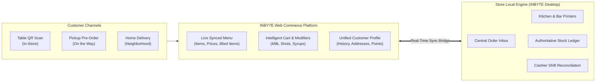

# INBYTE CAFÉ — WEBSITE PRODUCT STRATEGY & DIGITAL COMMERCE
## Turning the Café Website into a Native, Real-Time Commerce Channel

> **Author:** INBYTE Engineering Architecture  
> **Date:** September 2026  
> **Status:** CANONICAL STRATEGY & ARCHITECTURAL SPECIFICATION  
> **Scope:** Web Commerce, Table QR Ordering, Online Delivery & Unified System Integration

---

## 1. Executive Vision: The Web as a Native Store Front

In traditional food and beverage software, a café website is either:
1. A **static brochure** with phone numbers and a PDF menu that is always out of date.
2. A **bolted-on e-commerce shop** (e.g., Shopify, WooCommerce, or Salla) operating in complete isolation from the physical point-of-sale system, requiring separate inventory management and manual order transcription by staff.

**INBYTE Café establishes a new standard:**

> **The Central Proposition:**  
> The website is NOT a disconnected marketing channel. The website is an **integrated digital extension of the physical café counter**. It runs on the same product catalog, respects the same real-time stock levels, prints to the same kitchen/bar printers, and consolidates into the same cashier shift and financial ledger.



---

## 2. The Core Moat: INBYTE Digital Commerce vs. Industry Alternatives

Café owners currently face painful compromises when choosing technology. INBYTE Café eliminates every compromise:

| Dimension | Food Aggregators<br/>*(Talabat, Jahez, Hungerstation)* | Generic E-Commerce<br/>*(Shopify, WooCommerce, Salla)* | Enterprise Restaurant SaaS<br/>*(Foodics, OneClick)* | **INBYTE Café Unified Web Commerce** |
| :--- | :--- | :--- | :--- | :--- |
| **Commissions** | Punitive **15% to 30%** commission on every transaction. | Payment gateway fee + platform monthly subscription. | Monthly software fee per terminal + web add-on fees. | **0% Commission.** Direct store-to-customer commerce. |
| **Customer Data Ownership** | Zero customer ownership. You do not get phone numbers, emails, or direct relationships. | Full data ownership, but completely disconnected from physical store walk-ins. | Fragmented between cloud dashboard and store POS. | **100% Customer Ownership.** Unified profile across Counter, Table QR, and Web. |
| **Menu Maintenance** | Changes must be manually duplicated on aggregator tablets or portal. | Separate menu database. Updating prices in store does not update website. | Cloud-first; updates depend on cloud internet uptime. | **Single Source of Truth.** Edit once in Back Office $\rightarrow$ instant update on POS, QR, and Web. |
| **Stockout / 86 Protection** | Items sell out in store, but stay available on app, causing customer cancellations. | Web sells out-of-stock items; staff must call customer to apologize or cancel. | Often delayed batch syncs between POS and web store. | **Instant Out-of-Stock Sync.** Depleting beans or milk in POS instantly disables drink on Web. |
| **Kitchen Ticket Routing** | Aggregator tablet dings; cashier must manually re-enter order into POS. | Web orders notify via email or dashboard; no kitchen routing. | Requires proprietary cloud KDS or expensive cloud-linked printers. | **Automatic Station Routing.** Web order prints directly to Barista or Kitchen on native Win32 printers. |
| **Shift & Cash Reconciliation** | Payouts arrive weeks later; difficult to reconcile with daily drawer. | Reconciled separately in bank statements. | Separate cloud report. | **Integrated Cashier Shift.** COD and verified transfers integrate into the active daily shift. |

---

## 3. The Unified Customer Journey

INBYTE Web Commerce powers three primary customer journeys through a single responsive web application:

### Journey 1: Dine-In Table QR Ordering
*Target: Speed, convenience, reducing cashier line bottlenecks during peak morning rush.*

1. **Scan & Identify:** Guest sits at Table 4 and scans the physical QR code. The browser opens `https://cafe.inbyte.io/t/tbl_zamalek_04`.
2. **Contextualized Menu:** The web app detects `mode = 'DINE_IN'` and table `Table 4`. Delivery address and pickup time fields are suppressed.
3. **Customization:** Guest chooses an *Iced Spanish Latte*, selects *Oat Milk (+15 EGP)* and *Extra Double Shot (+20 EGP)*.
4. **Instant Submission:** Guest submits order with payment preference (e.g. *Pay at Counter / Cash* or *InstaPay*).
5. **Kitchen Ticket Dispatch:** Order hits the POS Order Inbox as `PENDING`. Barista accepts $\rightarrow$ Bar ticket prints instantly at the espresso bar:
   ```text
   ================================
             BAR TICKET            
   Order: #1084    Table: 4        
   Time: 10:14 AM  Channel: TABLE_QR
   --------------------------------
   1x Iced Spanish Latte           
      - Oat Milk                   
      - Extra Double Shot          
   ================================
   ```
6. **Live Status Screen:** The customer's mobile browser automatically transitions to a live status screen: `Order Received` $\rightarrow$ `Preparing` $\rightarrow$ `Ready`.

---

### Journey 2: On-the-Go Pickup (Click & Collect)
*Target: Busy office workers ordering 15 minutes ahead of arrival.*

1. **Browse:** Customer visits the café's custom domain on their smartphone or laptop.
2. **Select Fulfillment:** Selects **Pickup (استلام من الفرع)**.
3. **Cart & ETA:** Cart displays current store prep time (e.g. "Estimated Ready: 12–15 mins").
4. **Customer Identification:** Customer enters mobile phone; system auto-fills their name and past preferences via unified CRM.
5. **Order Verification:** Order arrives at POS inbox with clear visual `PICKUP` badge.
6. **Notification & Collection:** When barista taps `READY`, customer receives an automated SMS or WhatsApp alert: *"Your order #1085 is ready for pickup at the counter!"*

---

### Journey 3: Neighborhood Direct Delivery
*Target: Regular local customers ordering coffee and pastries to their home or office.*

1. **Select Delivery:** Customer selects **Delivery (توصيل للمنزل/المكتب)**.
2. **Address & Zone Resolution:** Customer inputs street, building, and apartment details. System matches delivery zone and adds the authoritative delivery fee (e.g. 15 EGP).
3. **Payment Choice:** Customer selects **Cash on Delivery (COD)** or **InstaPay / Bank Wallet Transfer**.
   - If *InstaPay*, customer is shown the store's InstaPay handle and transaction reference upload field (`payment_status = 'VERIFICATION_REQUIRED'`).
4. **Preparation & Driver Dispatch:**
   - Barista accepts order $\rightarrow$ Kitchen prepares food and beverage.
   - Dispatcher assigns the order to an active store driver (Captain Ahmed).
   - Order status moves to `OUT_FOR_DELIVERY`.
5. **Delivery & Settlement:**
   - Driver delivers order and collects cash.
   - Driver marks delivered; captain cash liability ledger records +120 EGP in Captain Ahmed's pouch.
   - At shift close, Captain Ahmed hands over cash to cashier $\rightarrow$ shift reconciled.

---

## 4. Web Commerce & Local POS Data Synchronization

The fundamental engineering challenge of connecting a local-first desktop POS to the public web is **bidirectional synchronization without compromising local offline resilience**.

```
┌─────────────────────────────────────────────────────────────┐
│                 SYNCHRONIZATION DATA FLOW                   │
├─────────────────────────────────────────────────────────────┤
│                                                             │
│   [STORE BACK OFFICE (Local SQLite)]                        │
│          │                                                  │
│   (1) Push Catalog & Stock States                           │
│          │                                                  │
│          ▼                                                  │
│   [CLOUD ENGINE (Supabase PostgreSQL / Edge)]               │
│          │                         ▲                        │
│   (2) Render Live Web Menu         │ (3) Ingest Orders      │
│          │                         │                        │
│          ▼                         │                        │
│   [CUSTOMER BROWSER] ──────────────┘                        │
│                                                             │
│          │                                                  │
│   (4) Pull Pending Orders to Store                          │
│          │                                                  │
│          ▼                                                  │
│   [STORE ORDER INBOX (Desktop Local SQLite)]                │
│          │                                                  │
│   (5) Push Status Updates (Accepted, Preparing, Ready)      │
│          │                                                  │
│          ▼                                                  │
│   [CUSTOMER TRACKING SCREEN (Supabase Realtime)]            │
│                                                             │
└─────────────────────────────────────────────────────────────┘
```

### 4.1 Push: Catalog, Pricing & Stockout Synchronization
- **Trigger:** Any price update, new menu item, or stockout change in the Back Office.
- **Payload:** Versioned JSON payload pushed to Supabase `synced_menu_items`.
- **86ing / Stockout Safeguard:** When raw materials (e.g. coffee beans) or finished goods hit `0`, the desktop engine triggers an immediate lightweight webhook to mark the item unavailable on the web. Customers cannot order sold-out items.

### 4.2 Pull: Order Ingestion & Zero-Trust Recalculation
- **Security Rule (Zero-Trust Pricing):** The web client submits item IDs, selected modifier option IDs, and quantities.
- **Recalculation:** When the local desktop pulls the order from the cloud inbox:
  1. It reads local authoritative prices from `products` and `modifier_options`.
  2. It calculates authoritative subtotal, delivery fee, taxes, and total in integer minor units (`i64` cents).
  3. If client-submitted total differs from server-calculated total, the local engine rejects the order or flags it for cashier review.

### 4.3 Offline Resilience Protocol
- If the café's internet connection drops:
  - **In-Store Operations Continue Uninterrupted:** Cashier POS, table QR orders on local Wi-Fi, receipts, and kitchen printers function 100% offline.
  - **Web Ordering Safety:** The cloud detects missed heartbeats (> 3 minutes without a ping from the store). The web store displays a polite banner: *"Online ordering is temporarily paused. Please call the café directly."* This prevents unfulfilled orders while offline.
  - **Reconnection:** Upon reconnection, the sync worker reconciles any pending cloud records and pushes updated stock ledgers.

---

## 5. Customer Relationship Management & Retention Engine

The web commerce platform is the primary funnel for customer acquisition and lifetime value (LTV):

### 5.1 Frictionless Onboarding
- No lengthy registration forms or password memory.
- Customers authenticate via **Mobile Phone OTP** or **Instant WhatsApp Magic Link**.
- Profile captures:
  - Full Name
  - Mobile Number
  - Saved Delivery Addresses (Home, Office, Girlfriend's Place)
  - Favorite Customizations (e.g., "Always Extra Oat Milk, No Sugar")

### 5.2 1-Click Re-Order
Over 70% of café customers order the exact same breakfast or coffee order every visit.  
The web interface features a prominent **"Re-Order My Usual"** card on the home screen:
> *"Order again: Flat White (Oat Milk) + Butter Croissant — Deliver to Zamalek Office"*  
> $\rightarrow$ 1 Click $\rightarrow$ Order Placed.

### 5.3 Unified Loyalty Points
- Every order placed via Web, Table QR, or in person at the Cashier POS accrues points to the same phone-indexed profile.
- Loyalty balances update in real time.
- Points can be redeemed for promotional discounts or free items on both the web store and the physical counter.

---

## 6. Store-Specific Branding & Multi-Branch Architecture

INBYTE Web Commerce is designed to adapt to single-store boutique roasteries as well as multi-branch regional chains:

1. **Single-Store Mode:**
   - Custom domain (e.g. `order.inbytecafe.com`).
   - Branded color theme, logo, hero banner, social links, and opening hours.
2. **Multi-Store Branch Picker:**
   - Customer opens website $\rightarrow$ selects nearest branch (e.g., *Zamalek Branch* vs. *New Cairo Branch*).
   - Menu dynamically reflects the selected branch's pricing, availability, and delivery radius.
   - Orders route exclusively to the selected branch's local POS engine.

---

## 7. Strategic Recommendations for Web Engineering

When building the customer-facing web platform in Phase 8 (Customer Web Commerce & Supabase Cloud Sync Platform):

1. **Framework:** Next.js or Vite React with Tailwind CSS, utilizing mobile-first responsive layout (90%+ of orders will originate from smartphones).
2. **Design Language:** Clean, modern, warm café aesthetic adhering strictly to the INBYTE Design System (dark espresso backgrounds, warm crema accents, crisp typography).
3. **Arabic-First / BiDi Native:** Arabic is the primary commercial language in Egypt and the MENA region. The UI must be designed natively for Right-to-Left (RTL) layout with fluid English/Arabic toggling.
4. **Performance:** Ultra-light initial bundle (< 150KB gzip) to guarantee sub-second load times over 3G/4G cellular connections in Cairo.
5. **No Direct SQLite Access:** The web application communicates strictly with Supabase Cloud APIs, preserving the security perimeter of the local store network.
